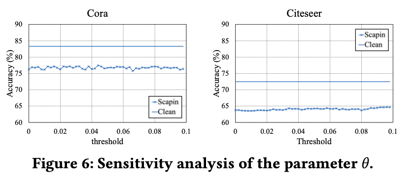
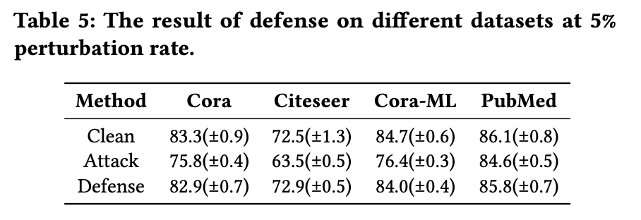

# Scapin: Scalable Graph Perturbation by Augmented InfluenceMaximization

The repository contains the implementation of our proposed Scapin method.

**To set up the environment:**

```bash
conda create -n scapin python=3.9
pip install -r requirements.txt
```

**The library provides two main methods: `generate` (perturbation generation) and `evaluate` (node classification evaluation).**

```python
Scapin.generate(adj: scipy.sparse.spmatrix, features: numpy.ndarray, labels: numpy.ndarray, split_idx: dict,
                ptb_rate: float, th: float, seed: int, device: str) -> scipy.sparse.lil_matrix:
```

Generate attacked graph using Scapin method.

Args:
    adj: the original adjacency matrix in scipy sparse matrix format
    features: 2D numpy array, i-th row representing the feature of i-th node
    labels: numpy array
    split_idx: built-in dictionary with "train", "valid", "test" as its key,
               each containing a built-in list of idx
    ptb_rate: built-in float number (0, 1), the perturb rate
    th: built-in float number, the parameter of Scapin method
    seed: built-in integer, the random seed
    device: built-in string, the pytorch device, default='cpu',
            see https://pytorch.org/docs/stable/tensor_attributes.html#torch.device

Returns:
    the perturbed adjacency matrix in scipy sparse lil format

```python
Scapin.evaluate(adj: scipy.sparse.spmatrix, features: numpy.ndarray, labels: numpy.ndarray, split_idx: dict,
                method: str, seed: int, device: str) -> float:
```

Evaluate a graph on a specific node classification method once.

Args:
    adj: the adjacency matrix in scipy sparse matrix format
    features: 2D numpy array, i-th row representing the feature of i-th node
    labels: numpy array
    split_idx: built-in dictionary with "train", "valid", "test" as its key,
               each containing a built-in list of idx
    method: built-in string, 'LPA' or 'GCN', representing the method, default='LBA'
    seed: integer, the random seed for evaluation, default=9
    device: built-in string, the pytorch device, default='cpu',
            see https://pytorch.org/docs/stable/tensor_attributes.html#torch.device

Returns:
    the accuracy metric

**See `example.py` for a detailed example with sample data loader.**

```bash
python example.py
```

## Results

1. Effectiveness evaluation


2. Runtime comparison


3. Memory comparison


4. Interpretability


5. Transferability


6. Sensitivity Analyses



6. Defense



